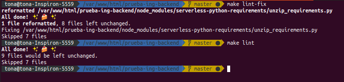
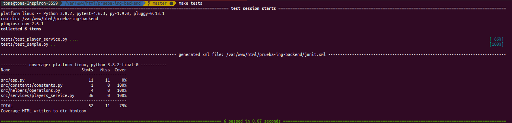
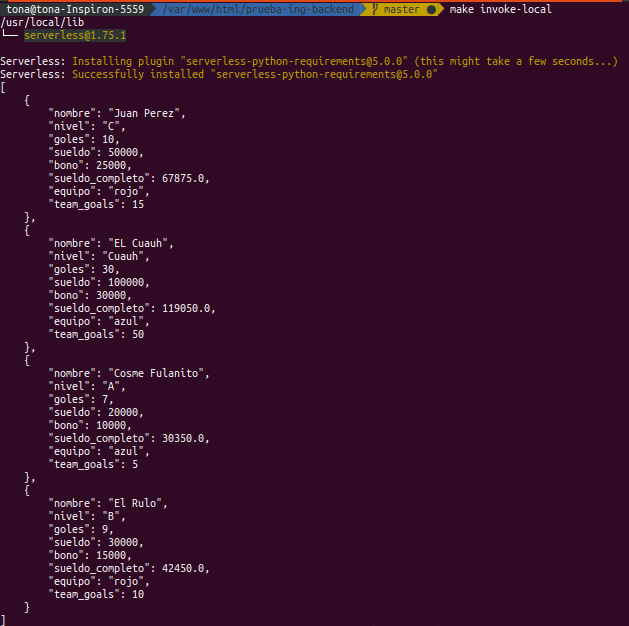

# Prueba Ingeniería Resuelve

## Tonatiuh Flores Castelán <tona.castelan16@gmail.com>


**NOTA:** Asegúrate de tener instalados los siguentes servicios

- make command (para ejecutar los comandos *make*)
- [serverless](https://www.serverless.com/framework/docs/providers/aws/guide/installation/)
- [Python 3.7](https://www.python.org/) o superior

## Clona el proyecto

```sh
git clone git@github.com:tonaflcastelan/prueba-ing-backend.git
```

## Instalación

Ejecuta el siguiente comando para instalar el proyecto de manera local:

```sh
make setup
```

## Lint

Formatea el código con buenas prácticas:

```sh
make lint-fix

make lint
```


## Tests

Ejecuta las pruebas unitarias de la aplicación:

```sh
make tests
```



## Invoke

Para ejecutar de manera local la prueba ejecuta el siguiente comando:

```sh
make invoke-local
```

De esta manera se estará ejecutando el test para al proyecto

Ejemplo:

